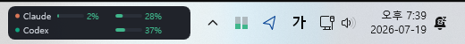
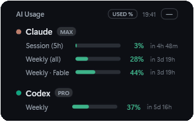
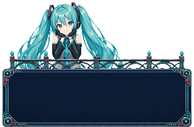
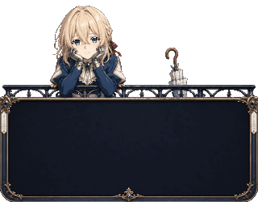
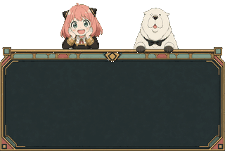
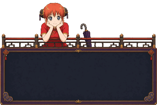
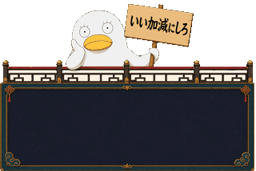
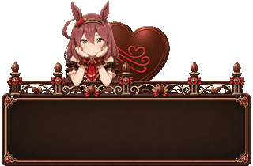
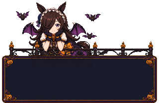
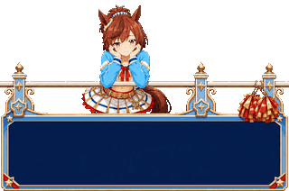

<div align="center">

# AI Usage

**Claude Code and Codex quotas — usage, limits, and reset countdowns at a glance.**

A tiny always-on-top Windows widget with tray & taskbar mini-gauges
and animated character themes.


<br/>

**Always on your taskbar** — mini gauges beside the tray, columns aligned by quota type



<br/>

## Pick your companion

Twelve themes — Default plus eleven animated companions — switchable instantly
from Settings. The picker and this gallery use the same character groups.

<h3>General</h3>
<table>
  <tr>
    <th align="center">Default</th>
  </tr>
  <tr>
    <td align="center" valign="bottom"></td>
  </tr>
</table>

<h3>VOCALOID</h3>
<table>
  <tr>
    <th align="center">Hatsune Miku</th>
  </tr>
  <tr>
    <td align="center" valign="bottom"></td>
  </tr>
</table>

<h3>Violet Evergarden</h3>
<table>
  <tr>
    <th align="center">Violet</th>
  </tr>
  <tr>
    <td align="center" valign="bottom"></td>
  </tr>
</table>

<h3>SPY×FAMILY</h3>
<table>
  <tr>
    <th align="center">Anya &amp; Bond</th>
  </tr>
  <tr>
    <td align="center" valign="bottom"></td>
  </tr>
</table>

<h3>Gintama</h3>
<table>
  <tr>
    <th align="center" width="50%">Kagura</th>
    <th align="center" width="50%">Elizabeth</th>
  </tr>
  <tr>
    <td align="center" valign="bottom"></td>
    <td align="center" valign="bottom"></td>
  </tr>
</table>

<h3>Umamusume: Pretty Derby</h3>
<table>
  <tr>
    <th align="center" width="33%">Bourbon (Valentine)</th>
    <th align="center" width="33%">Rice Shower (Halloween)</th>
    <th align="center" width="33%">Oguri Cap (Christmas)</th>
  </tr>
  <tr>
    <td align="center" valign="bottom"></td>
    <td align="center" valign="bottom"></td>
    <td align="center" valign="bottom"></td>
  </tr>
  <tr>
    <th align="center">Nice Nature (RUN&amp;WIN)</th>
    <th align="center">Maruzensky (Summer Night)</th>
    <th align="center">Curren Chan (Wedding)</th>
  </tr>
  <tr>
    <td align="center" valign="bottom"></td>
    <td align="center" valign="bottom"></td>
    <td align="center" valign="bottom"></td>
  </tr>
</table>

<sub>Gallery animations are rebuilt from the current runtime theme packs; source and output hashes are recorded in <a href="docs/theme-gifs/manifest.json">the gallery manifest</a>.</sub>

</div>

## Features

- **Live quota tracking** — Claude (5h session, weekly, per-model weekly, extra credits) and Codex (weekly), each with a usage bar and reset countdown
- **Three ways to watch**
  - *Widget* — always on top, drag to move, remembers its position, adjustable opacity and layout, `—` minimizes to tray
  - *Tray icon* — dual mini gauges with a tooltip summary; double-click toggles the widget
  - *Taskbar gauges* (optional) — always visible beside the tray, columns aligned by quota type, auto-hidden during fullscreen apps
- **Threshold colors** — configurable warning levels (yellow 70% / red 90% by default) and a `LIMIT` badge when a quota is exhausted
- **Used ↔ remaining** — click the `USED %` / `LEFT %` chip; horizontal or vertical layout
- **Character themes** — grouped by series in Settings and switchable without a restart
- **Runs itself** — start with Windows, automatic token refresh, login auto-detection, and recovery after an explorer restart

## Getting started

**Requirements**: Windows 10/11 · .NET 8 Desktop Runtime (not needed for self-contained builds) · a logged-in Claude Code CLI (`~/.claude/.credentials.json`) and/or Codex CLI (`~/.codex/auth.json`)

```powershell
cd QuotaDeck
dotnet run -c Release             # run it

# single-file executable
dotnet publish -c Release -r win-x64 --self-contained false /p:PublishSingleFile=true
# bundle the runtime too (no .NET install required)
dotnet publish -c Release -r win-x64 --self-contained true /p:PublishSingleFile=true
```

Output: `QuotaDeck\bin\Release\net8.0-windows\win-x64\publish\QuotaDeck.exe`

## Usage

| Action | How |
|---|---|
| Move the widget | Drag anywhere (position is saved) |
| Used ↔ remaining | Click the `USED %` / `LEFT %` chip in the header |
| Open the official usage page | Click a service name |
| Menu | Right-click the widget — refresh · layout · settings · hide · quit |
| Start with Windows | Settings → "Start with Windows" (enable it from the published exe) |
| Taskbar gauges | Settings → "Show mini gauges in the taskbar" |

## How it works

- **Claude** — `api.anthropic.com/api/oauth/usage`, reusing Claude Code's OAuth token; expired tokens are refreshed and written back to the credential file atomically.
- **Codex** — `chatgpt.com/backend-api/wham/usage`, reusing the Codex CLI's OAuth token, falling back to the `rate_limits` snapshots in `~/.codex/sessions` when the API is unreachable.
- Both endpoints are undocumented internal APIs and may change without notice, so every field is parsed defensively. Credentials are never deleted or sent anywhere else.
- Settings live in `%APPDATA%\QuotaDeck\settings.json`.

## License

- Code: [MIT](LICENSE)
- Character theme assets are **not** covered by the MIT license and remain subject to their rights holders' terms:
  - This work depicts Crypton Future Media, INC.'s character Hatsune Miku under the [Piapro Character License (PCL)](https://piapro.jp/license/pcl/summary_en). Hatsune Miku © Crypton Future Media, INC. [www.piapro.net](https://piapro.net)
  - **Umamusume: Pretty Derby** — Mihono Bourbon, Rice Shower, Oguri Cap, Nice Nature, Maruzensky, and Curren Chan; © Cygames, Inc., [Umamusume derivative works guidelines](https://umamusume.jp/derivativework_guidelines/)
  - Violet Evergarden — © Kana Akatsuki / Kyoto Animation (non-commercial fan content)
  - SPY×FAMILY (Anya &amp; Bond) — © Tatsuya Endo / Shueisha, SPY×FAMILY Project (non-commercial fan content)
  - Gintama (Kagura, Elizabeth) — © Hideaki Sorachi / Shueisha (non-commercial fan content)
